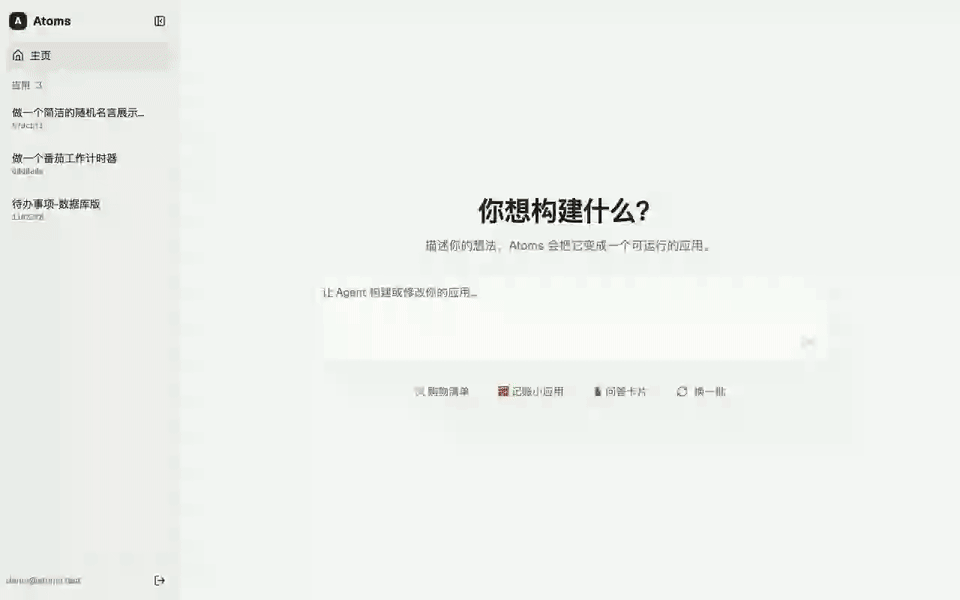
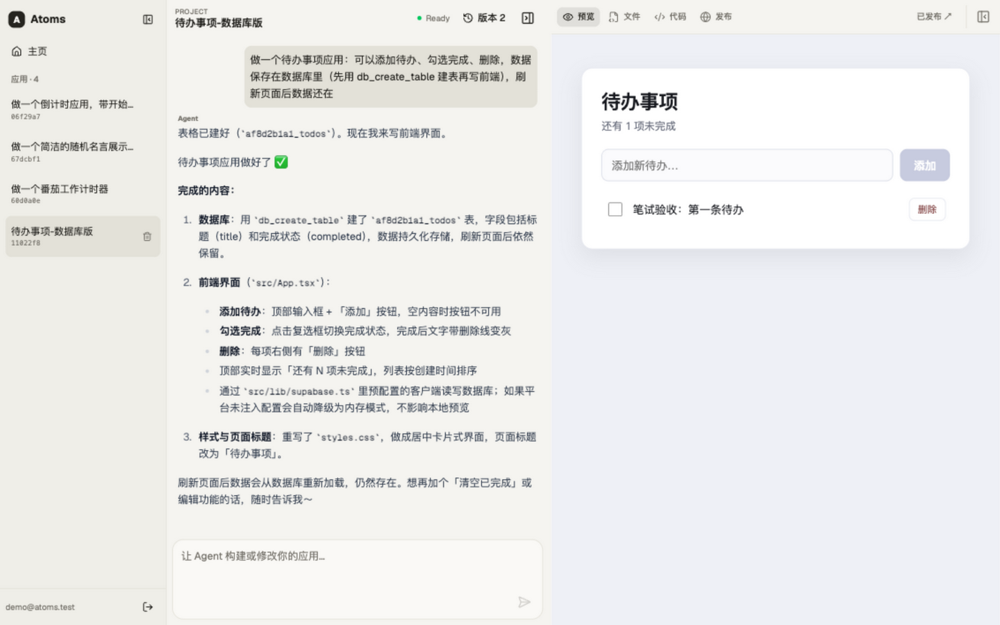
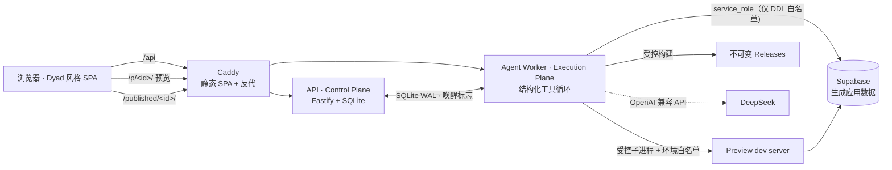

# Atoms

**用一句话描述想法，Agent 在隔离工作区里把它变成可运行、可发布的应用。**

在线体验：<http://119.28.133.244>（演示账号 `demo@atoms.test` / `demo-password`）· 笔试交付说明：[SUBMISSION.md](SUBMISSION.md)



产品体验参考 [Atoms](https://atoms.dev) / [Dyad](https://dyad.sh)，但按多用户 Web 系统重新设计：控制面、工作区、执行面三平面分离，契约先行（Zod 运行时校验），Git 是代码事实来源，数据库只存元数据。

## 核心能力

| 能力       | 说明                                                                                                                           |
| ---------- | ------------------------------------------------------------------------------------------------------------------------------ |
| 对话式生成 | 自然语言 → Agent 经 8 个结构化工具（Zod 双端校验）读写工作区，回复逐 token 流式呈现，每轮成功自动形成 Git 版本；失败带一键重试 |
| 全栈生成   | 一句话生成带数据库 CRUD 的应用：Agent 受控建表（标识符/类型白名单 + 行级安全），前端 anon key 直连 Supabase                    |
| 实时预览   | dev server 受控子进程，`/p/<id>/` 公开网关访问；空闲 10 分钟自动回收，打开即唤醒，实测发消息到预览就绪约 17 秒                 |
| 发布与回退 | 受控 `vite build` → 不可变 release → 激活指针原子切换，任意历史版本一键秒级回退，附扫码分享二维码                              |
| 应用管理   | 侧栏集中管理全部应用，悬停即删（事务清理元数据、工作区与发布产物），活跃生成中的项目受保护不可误删                             |
| 多用户隔离 | scrypt 口令 + 会话 Cookie，全部资源按账号过滤，写操作要求客户端头                                                              |



## 架构

单机 Demo 拓扑（企业级演进路径见 [ADR 0005](docs/adr/0005-demo-runtime-topology.md)）：



关键决策都有对应的 ADR 与取舍说明：[docs/adr/](docs/adr/)。安全设计（sandbox 边界、密钥隔离、RLS、CSRF 防护）与已知取舍见 [SUBMISSION.md](SUBMISSION.md)。

## 快速开始（90 秒）

```bash
git clone https://github.com/idongdongh/Atoms.git && cd Atoms
pnpm install
pnpm dev     # API :3000 + Web :5173 + Worker（离线 demo 模型，无需任何密钥）
```

打开 <http://localhost:5173>，注册后描述一个想法即可（API 健康检查：`http://localhost:3000/health`）。接入真实模型与数据库只需在 `.env` 填三组环境变量（模板见 `.env.example`）；生产部署（Docker Compose + Caddy）见 [docs/deployment.md](docs/deployment.md)。

## 仓库结构

```text
apps/api            Control Plane：HTTP API、预览/发布网关、会话与多用户隔离
apps/agent-worker   Execution Plane：Agent 运行器、结构化工具、预览生命周期
apps/web            构建器前端（Dyad 前端移植，MIT 署名，Manus 暖纸主题）
packages/contracts  全部共享契约（Zod Schema，运行时校验）
packages/db         平台元数据存储（node:sqlite, WAL）
packages/workspace-sdk   工作区 Git 操作、写锁、模板实例化
packages/sandbox-sdk     受控子进程 Provider（预览 dev server、受控构建）
templates/react-vite     生成应用的起步模板（含 Supabase client）
docs/               ADR、开发计划、部署手册
```

## 工程实践

- `pnpm check` = 格式 + 类型 + **70 个单元/集成测试** + 构建，全部通过
- 两轮对抗式审查（并发、安全、部署链路）的发现与修复记录在 Git 历史
- 长任务事件持久化、按序列号可重放，SSE 断线用 `Last-Event-ID` 续传
- 每项目同一时刻最多一个写入 Run（claim 事务），所有写请求带幂等键

更多文档：[SUBMISSION.md](SUBMISSION.md)（交付说明）· [docs/README.md](docs/README.md)（文档索引）· [AGENTS.md](AGENTS.md)（协作规则）
