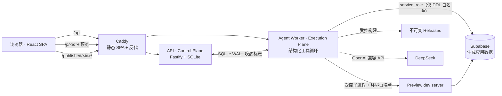

# 架构

按产品定位拆成三个平面，契约先行（Zod Schema 运行时双端校验），Git 是代码事实来源，数据库只存元数据。

## 拓扑

单机部署形态（企业级演进路径见 [ADR 0005](adr/0005-demo-runtime-topology.md)）：



- **Control Plane**（apps/api）：会话与多用户隔离、预览/发布网关、SSE 事件流。
- **Execution Plane**（apps/agent-worker）：Agent 工具循环、流式输出、预览生命周期（空闲回收、唤醒、重试）。
- **Workspace Plane**：每项目独立 Git 工作区 + 写锁；预览与构建作为受控子进程运行，环境变量白名单隔离密钥。

## 仓库结构

```text
apps/api            Control Plane：HTTP API、预览/发布网关、会话与多用户隔离
apps/agent-worker   Execution Plane：Agent 运行器、结构化工具、预览生命周期
apps/web            构建器前端（React SPA）
packages/contracts  全部共享契约（Zod Schema，运行时校验）
packages/db         平台元数据存储（node:sqlite, WAL）
packages/workspace-sdk   工作区 Git 操作、写锁、模板实例化
packages/sandbox-sdk     受控子进程 Provider（预览 dev server、受控构建）
templates/react-vite     生成应用的起步模板（Tailwind + Supabase client）
docs/               架构、部署手册、ADR
```

## 工程实践

- `pnpm check` = 格式 + 类型 + 70 个单元/集成测试 + 构建，全部通过
- 两轮对抗式审查（并发、安全、部署链路）的发现与修复记录在 Git 历史
- 长任务事件持久化、按序列号可重放，SSE 断线用 `Last-Event-ID` 续传
- 每项目同一时刻最多一个写入 Run（claim 事务），所有写请求带幂等键
